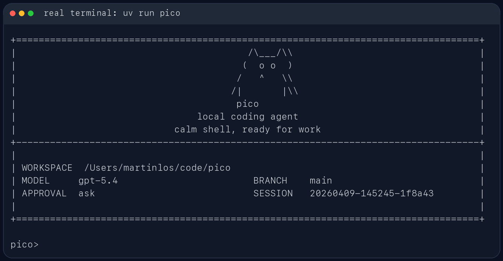

# forgepilot

`forgepilot` 是一个面向代码仓库的轻量本地 coding agent。它直接跑在终端里，先看当前工作区，再用一组受约束的工具去读文件、改文件、跑命令，并把会话状态保存在本地 `.ForgePilot/` 目录里。

它更像一个能在仓库里持续工作的命令行助手，不是纯聊天窗口。你可以拿它做代码排查、测试修复、仓库分析，或者让它在当前项目里执行一次性的工程任务。

## 适合做什么

- 在本地仓库里排查测试失败
- 读取当前代码结构并给出修改建议
- 基于现有文件做小步迭代，而不是脱离仓库空想
- 在会话中保留上下文，支持继续上一次工作

## 主要特性

- 包名是 `forgepilot`
- CLI 命令是 `forgepilot`
- 模块入口是 `python -m forgepilot`
- 会话保存在 `.ForgePilot/sessions/`
- 每次运行的工件保存在 `.ForgePilot/runs/<run_id>/`
- 支持四类模型后端：
  - Ollama
  - OpenAI 兼容 Responses API
  - Anthropic 兼容 Messages API
  - DeepSeek Anthropic 兼容 API

## 使用截图

CLI 帮助信息：


启动界面：



REPL 内置命令与会话路径：


## 从零启动：OpenAI API 示例

下面按 Windows + WSL/Ubuntu 终端写。照着做即可。

### 1. 打开终端并进入项目

打开 Windows Terminal，选择 Ubuntu / WSL 终端。看到类似 `用户名@电脑名:~$` 的提示符后，输入：

```bash
cd /mnt/d/AIProjects/pico-main/forgepilot
```

### 2. 创建 Python 环境并安装 ForgePilot

需要 Python 3.10+。第一次使用建议创建虚拟环境：

```bash
python3 -m venv .venv
source .venv/bin/activate
python -m pip install -e .
```

安装后先确认命令能跑：

```bash
python -m forgepilot --help
```

如果能看到命令帮助，说明安装成功。

### 3. 创建 `.env` 文件并填写 OpenAI API

在项目根目录创建一个真实配置文件：

```bash
cp .env.example .env
```

然后用 VS Code、记事本或其他编辑器打开这个文件：

```text
D:\AIProjects\pico-main\forgepilot\.env
```

把里面内容替换成下面这样：

```env
FORGEPILOT_OPENAI_API_BASE=https://api.openai.com/v1
FORGEPILOT_OPENAI_API_KEY=你的 OpenAI API Key
FORGEPILOT_OPENAI_MODEL=gpt-5.5
```

OpenAI API Key 可以在 [OpenAI API keys](https://platform.openai.com/api-keys) 创建。可用模型名以 [OpenAI models](https://platform.openai.com/docs/models) 为准；如果启动时报 `model not found`，把 `FORGEPILOT_OPENAI_MODEL` 换成你账号可用的模型 ID。

`.env` 不要提交到 Git，因为里面有真实密钥。

### 4. 启动交互模式

```bash
python -m forgepilot --provider openai
```

看到欢迎界面，并出现下面提示符，就说明启动成功：

```text
forgepilot>
```

可以输入：

```text
请先用 update_plan 创建计划，然后阅读 README.md，总结这个项目是干什么的。
```

再输入：

```text
/plan
```

就能看到当前任务计划。

### 5. 让 ForgePilot 操作另一个代码仓库

如果你要让它分析或修改别的项目，用 `--cwd` 指向那个项目：

```bash
python -m forgepilot --cwd /path/to/your/repo --provider openai
```

例如创建一个最小 demo 仓库：

```bash
mkdir -p /tmp/forgepilot-demo
cd /tmp/forgepilot-demo
git init
cat > calc.py <<'PY'
def add(a, b):
    return a - b
PY
cat > test_calc.py <<'PY'
from calc import add

def test_add():
    assert add(2, 3) == 5
PY
```

然后启动 ForgePilot：

```bash
cd /mnt/d/AIProjects/pico-main/forgepilot
source .venv/bin/activate
python -m forgepilot --cwd /tmp/forgepilot-demo --provider openai
```

进入 `forgepilot>` 后输入：

```text
请先用 update_plan 创建计划，然后检查为什么测试失败，修复代码，并运行 python -m pytest -q 验证。
```

运行结束后，可以查看本地运行工件：

```bash
ls -R /tmp/forgepilot-demo/.ForgePilot/runs
```

重点看每个 run 目录里的：

- `task_state.json`
- `trace.jsonl`
- `report.json`

## 其他模型后端

forgepilot 启动时会读取项目根目录的 `.env`。配置优先级是：

```text
显式 CLI 参数 > .env 里的 FORGEPILOT_* 变量 > 旧环境变量 > 代码默认值
```

### OpenAI 兼容接口

OpenAI 官方 API：

```env
FORGEPILOT_OPENAI_API_BASE=https://api.openai.com/v1
FORGEPILOT_OPENAI_API_KEY=your-api-key
FORGEPILOT_OPENAI_MODEL=gpt-5.5
```

```bash
python -m forgepilot --provider openai
```

### Anthropic 兼容接口

默认 Anthropic 兼容接口使用 right.codes 的 Claude endpoint：

```env
FORGEPILOT_ANTHROPIC_API_BASE=https://www.right.codes/claude/v1
FORGEPILOT_ANTHROPIC_API_KEY=your-api-key
FORGEPILOT_ANTHROPIC_MODEL=claude-sonnet-4-6
```

```bash
python -m forgepilot --provider anthropic
```

如果你的服务端对多个兼容接口复用了同一套密钥，`forgepilot` 也支持从 `FORGEPILOT_ANTHROPIC_API_KEY` 回退到 `ANTHROPIC_API_KEY`、`FORGEPILOT_RIGHT_CODES_API_KEY`、`RIGHT_CODES_API_KEY`、`FORGEPILOT_OPENAI_API_KEY` 或 `OPENAI_API_KEY`。

### DeepSeek

```env
FORGEPILOT_DEEPSEEK_API_BASE=https://api.deepseek.com/anthropic
FORGEPILOT_DEEPSEEK_API_KEY=your-api-key
FORGEPILOT_DEEPSEEK_MODEL=deepseek-v4-pro
```

```bash
python -m forgepilot --provider deepseek
```

默认 DeepSeek base URL 是 `https://api.deepseek.com/anthropic`，走 DeepSeek 的 Anthropic 兼容接口。如果需要改到代理服务，可以设置 `FORGEPILOT_DEEPSEEK_API_BASE` 或启动时传 `--base-url`。

### Ollama

```bash
ollama serve
ollama pull qwen3.5:4b
python -m forgepilot --provider ollama --model qwen3.5:4b
```

Ollama 是本地模型后端，不需要 API key。

## 常用交互命令

- `/help`：查看内置命令
- `/memory`：查看提炼后的工作记忆
- `/plan`：查看当前任务计划
- `/session`：查看当前会话文件路径
- `/reset`：清空当前会话状态
- `/exit` 或 `/quit`：退出 REPL

## 安全与持久化

`forgepilot` 不会默认把所有动作都放开。像 shell 执行、文件写入这类高风险操作，会受审批模式控制：

- `--approval ask`
- `--approval auto`
- `--approval never`

每次运行结束后，都会在 `.ForgePilot/runs/<run_id>/` 下写出这些文件：

- `task_state.json`
- `trace.jsonl`
- `report.json`

这些内容默认只保存在本地，不需要跟仓库一起提交。

## 开发

如果装了 Ruff，可以这样检查：

```bash
uv run ruff check .
```
